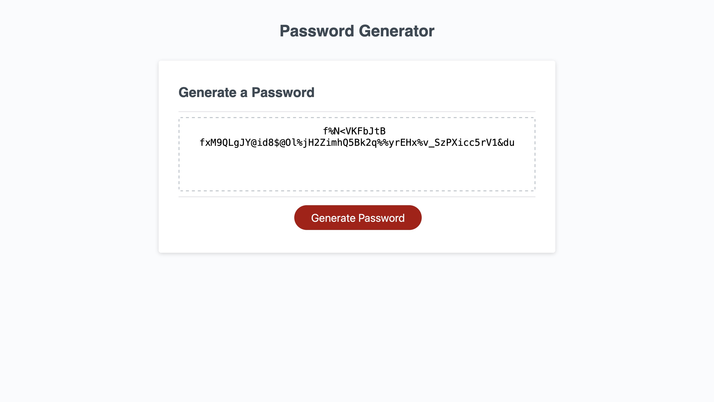

# Peter Geipel's Random Password Generator

## Description

This page provides a random password generator anywhere from 8 to 128 characters.  Through a series of prompts, the user selects the length of the password as well as the types of characters used (uppercase, lowercase, numeral, and special.)  Once the selections of the prompts have been fully made, the generator will immediately produce a password on the screen conforming to the preferences of the user.

https://pwgeipel.github.io/password-project/

